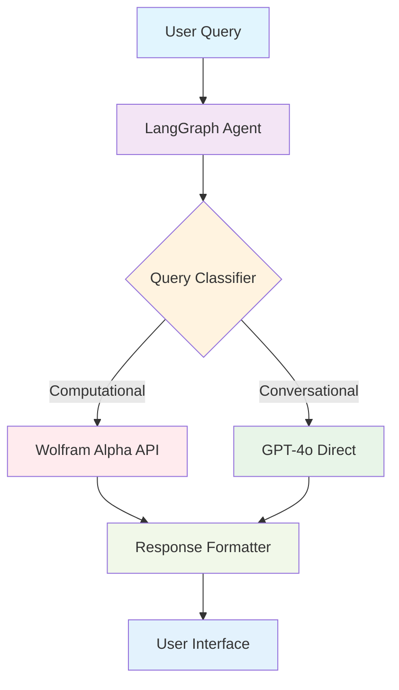

# 🧠 Wolfram Alpha AI Chatbot

A professional AI chatbot that intelligently combines **GPT-4o** with **Wolfram Alpha** using **LangGraph** for computational and conversational queries. The system automatically decides when to use computational tools versus direct conversation, providing a seamless user experience.

[](https://www.python.org/downloads/)
[](https://reactjs.org/)
[](https://fastapi.tiangolo.com/)
[](https://github.com/langchain-ai/langgraph)
[](LICENSE)

## 🎯 Features

- **🤖 Intelligent Routing**: LangGraph workflow automatically decides between computational and conversational responses
- **🧮 Wolfram Alpha Integration**: Handles complex calculations, unit conversions, scientific queries, and real-time data
- **💬 Natural Conversation**: GPT-4o provides engaging responses for general topics and explanations
- **🎨 Professional UI**: Modern React interface with OpenAI and Wolfram Alpha branding
- **📱 Responsive Design**: Works seamlessly on desktop, tablet, and mobile devices
- **⚡ Real-time Indicators**: Visual cues show when computational tools are being used
- **🔍 Connection Monitoring**: Real-time backend connectivity status
- **📊 Performance Metrics**: Response time tracking and processing insights

## 🏗️ Architecture



### Decision Logic

The agent uses GPT-4o to classify queries and route them appropriately:

- **🧮 Wolfram Alpha**: Mathematical calculations, scientific data, unit conversions, equations, weather, geographic data
- **💭 Direct Response**: General conversation, creative writing, explanations, advice, jokes, philosophical discussions

## 🚀 Quick Start

### Prerequisites

- **Python 3.8+**
- **Node.js 18+**
- **OpenAI API Key** ([Get here](https://platform.openai.com/api-keys))
- **Wolfram Alpha App ID** ([Get here](https://developer.wolframalpha.com/portal/myapps/))

### 1. Clone the Repository

```bash
git clone https://github.com/yourusername/wolfram-chatbot.git
cd wolfram-chatbot
```

### 2. Backend Setup

```bash
cd backend

# Create virtual environment
python -m venv venv
source venv/bin/activate  # On Windows: venv\Scripts\activate

# Install dependencies
pip install -r requirements.txt

# Configure environment
cp .env.example .env
# Edit .env with your API keys:
# OPENAI_API_KEY=sk-your-openai-api-key-here
# WOLFRAM_APP_ID=your-wolfram-app-id-here

# Start the backend server
python main.py
```

The backend will be available at `http://localhost:8000`

### 3. Frontend Setup

```bash
cd ../frontend

# Install dependencies
npm install

# Start development server
npm run dev
```

The frontend will be available at `http://localhost:3000`

## 📁 Project Structure

```
wolfram-chatbot/
├── backend/                    # Python FastAPI backend
│   ├── main.py                # FastAPI server and endpoints
│   ├── langgraph_agent.py     # LangGraph workflow implementation
│   ├── requirements.txt       # Python dependencies
│   ├── .env.example          # Environment variables template
│   └── README.md             # Backend documentation
├── frontend/                  # React frontend
│   ├── src/
│   │   ├── App.jsx           # Main React application
│   │   ├── main.jsx          # Application entry point
│   │   └── index.css         # Global styles
│   ├── package.json          # Node.js dependencies
│   ├── vite.config.js        # Vite configuration
│   ├── tailwind.config.js    # Tailwind CSS setup
│   └── README.md             # Frontend documentation
├── .gitignore                # Git ignore rules
└── README.md                 # This file
```

## 🎮 Usage Examples

### Computational Queries (Uses Wolfram Alpha)

```
🧮 "What is the integral of x² + 3x + 2?"
🧮 "Convert 100 fahrenheit to celsius"
🧮 "What is the population of Tokyo?"
🧮 "Solve the equation 2x + 5 = 15"
🧮 "Calculate compound interest on $1000 at 5% for 10 years"
```

### Conversational Queries (Direct GPT-4o Response)

```
💭 "Tell me a joke about mathematics"
💭 "How are you doing today?"
💭 "Explain quantum computing in simple terms"
💭 "What's your favorite color?"
💭 "Give me advice on learning programming"
```

## 🔧 API Reference

### Backend Endpoints

| Endpoint | Method | Description |
|----------|--------|-------------|
| `/` | GET | Health check and status |
| `/api/chat` | POST | Main chat endpoint |
| `/api/examples` | GET | Get example queries |
| `/api/status` | GET | Detailed status information |

### Chat API Request/Response

**Request:**
```json
{
  "message": "What is the derivative of sin(x)?",
  "conversation_history": []
}
```

**Response:**
```json
{
  "content": "The derivative of sin(x) is cos(x)...",
  "usedWolfram": true,
  "timestamp": "2024-01-01T12:00:00Z",
  "processingTime": 2.34
}
```

## 🛠️ Development

### Backend Development

```bash
cd backend
source venv/bin/activate

# Run with auto-reload
uvicorn main:app --reload --log-level debug

# View API documentation
open http://localhost:8000/docs
```

### Frontend Development

```bash
cd frontend

# Development server with hot reload
npm run dev

# Build for production
npm run build

# Preview production build
npm run preview
```

### Environment Variables

**Backend (`.env`):**
```env
OPENAI_API_KEY=sk-your-openai-api-key-here
WOLFRAM_APP_ID=your-wolfram-app-id-here
LOG_LEVEL=INFO
```

## 🐳 Docker Deployment

### Docker Compose

```yaml
version: '3.8'
services:
  backend:
    build: ./backend
    ports:
      - "8000:8000"
    environment:
      - OPENAI_API_KEY=${OPENAI_API_KEY}
      - WOLFRAM_APP_ID=${WOLFRAM_APP_ID}
    
  frontend:
    build: ./frontend
    ports:
      - "3000:3000"
    depends_on:
      - backend
```

Run with:
```bash
docker-compose up --build
```

## 🧪 Testing

### Test the Decision Logic

The agent automatically routes queries based on content:

| Query Type | Example | Route | Indicator |
|------------|---------|-------|-----------|
| Mathematical | "What is 2^50?" | Wolfram Alpha | 🧮 Badge |
| Conversational | "Tell me a joke" | Direct GPT-4o | 💭 No badge |
| Scientific | "Speed of light" | Wolfram Alpha | 🧮 Badge |
| Creative | "Write a poem" | Direct GPT-4o | 💭 No badge |

### Backend Testing

```bash
cd backend
# Test health endpoint
curl http://localhost:8000/

# Test chat endpoint
curl -X POST http://localhost:8000/api/chat \
  -H "Content-Type: application/json" \
  -d '{"message": "What is 2+2?"}'
```

## 📊 Monitoring and Debugging

### Backend Logs

The backend provides detailed logging:
- Query classification decisions
- Wolfram Alpha API calls
- Response generation timing
- Error conditions

### Frontend Debug Features

- Real-time connection status
- Processing time display
- Tool usage indicators
- Error message display

## 🔒 Security Considerations

- API keys stored in environment variables
- CORS properly configured for frontend domains
- Input validation on all endpoints
- Rate limiting recommended for production
- HTTPS required for production deployment

## 🚀 Production Deployment

### Backend (Python)

```bash
# Install production dependencies
pip install gunicorn

# Run with Gunicorn
gunicorn main:app -w 4 -k uvicorn.workers.UvicornWorker --bind 0.0.0.0:8000
```

### Frontend (React)

```bash
# Build for production
npm run build

# Serve with any static file server
npx serve -s dist -l 3000
```

### Environment Setup

- Set `NODE_ENV=production` for frontend
- Configure proper CORS origins for production domains
- Use environment-specific API endpoints
- Enable logging aggregation and monitoring

## 🤝 Contributing

1. Fork the repository
2. Create a feature branch (`git checkout -b feature/amazing-feature`)
3. Commit your changes (`git commit -m 'Add amazing feature'`)
4. Push to the branch (`git push origin feature/amazing-feature`)
5. Open a Pull Request

### Development Guidelines

- Follow PEP 8 for Python code
- Use ESLint for JavaScript/React code
- Add tests for new features
- Update documentation for API changes
- Ensure responsive design for UI changes

## 📝 License

This project is licensed under the MIT License - see the [LICENSE](LICENSE) file for details.

## 🙏 Acknowledgments

- **OpenAI** for GPT-4o API
- **Wolfram Research** for Wolfram Alpha API
- **LangChain** for LangGraph framework
- **FastAPI** for the excellent Python web framework
- **React** and **Tailwind CSS** for the modern frontend stack

## 📞 Support

- **Issues**: [GitHub Issues](https://github.com/yourusername/wolfram-chatbot/issues)
- **Discussions**: [GitHub Discussions](https://github.com/yourusername/wolfram-chatbot/discussions)
- **Documentation**: See individual README files in `/backend` and `/frontend` directories

## 🔄 Version History

- **v1.0.0** - Initial release with LangGraph workflow and React frontend
- **v0.9.0** - Beta release with basic Wolfram Alpha integration
- **v0.8.0** - Alpha release with FastAPI backend

---

Made with ❤️ using GPT-4o, Wolfram Alpha, and LangGraph